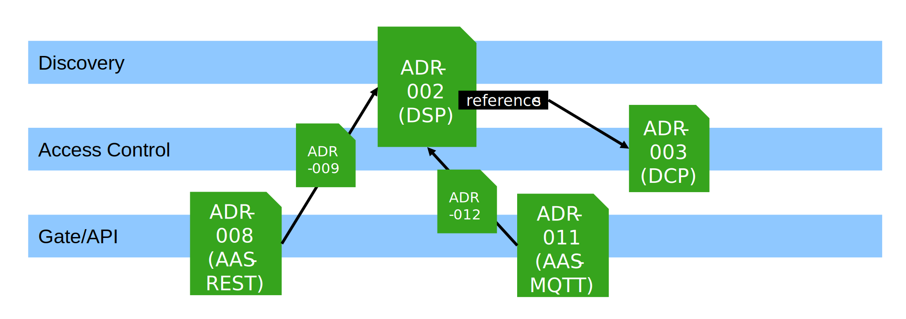

<!-- truncate -->

This [set of webpages](http://localhost:3000/architecture-decisions/) specifies the first release of the Factory-X data ecosystem.

### On Releases

Like every Dataspace, Factory-X is build on the mutual agreement between participants to expose interfaces accordingly
to specifications. A release like this one is a snapshot on a timeline of specifications and implementation projects.
As such, it bundles Factory-X Architecture Decision Records (ADRs) at certain versions with software at certain
versions. Releases use [CalVer](https://calver.org/#scheme) with YYYY-MM scheme. ADRs use [SemVer](https://semver.org/). 

### State of the Spec

In the [MX-Port Concept Paper](https://factory-x.org/wp-content/uploads/MX-Port-Concept-V1.10.pdf) (link opens pdf), 
Factory-X has promised three separate sets of specifications. The ADRs (published and agreed by the consortium) map to 
one or more of these three "MX-Port Configurations". All ADRs in the 2025-12 release are published in the context of 
MX-Port "Hercules" that strives for interoperability with the Catena-X Dataspace.

The figure above explains the interconnection between the ADRs. ADR-009 and ADR-012 are exclusively there to hook the
underlying technologies (AAS over HTTP and AAS over MQTT) into the extension points of the Dataspace Protocol.

### Implementation Report

The Factory-X project collaboratively develops software in the [factory-x-contributions](https://github.com/factory-x-contributions) 
Github organization. Its purpose is to bridge the gap between paper and runnable code and thus to inform specification 
activities with the experience gained. The table below only lists the implementations that are driven from the 
Factory-X project.

| Conforming Implementation                                                                  | Artifact   | ADRs                                                             | Description                                                                                                                                                                          |
|--------------------------------------------------------------------------------------------|------------|------------------------------------------------------------------|--------------------------------------------------------------------------------------------------------------------------------------------------------------------------------------|
| [Factory-X EDC](https://github.com/factory-x-contributions/factoryx-edc)                   | `0.2.1`    | ADR-002 0.2.0, ADR-003 0.2.0                                     | Factory-X EDC implements the APIs specified by the protocols based on                                                                                                                |
| [DSP-native Basyx](https://github.com/factory-x-contributions/dsp-native-basyx)            | `0.1.0`    | ADR-002 0.2.0, ADR-003 0.2.0, ADR-008 (only the Repository-APIs) | The project extends on the Basyx Java Server SDK and the Dataspace Protocol Lib to ship an AAS-server (ADR-008) that is natively secured with the Dataspace APIs (ADR-002, ADR-003). |
| [fa3st-service (Factory-X fork)](https://github.com/factory-x-contributions/fa3st-service) | `security` | ADR-008 0.2.0 (Only the Repository-APIs), ADR-011                | The development fork of the FAAAST AAS framework implements a set of features that transcend the current                                                                             |

Other full or partial implementations may already exist in commercial or open-source repositories. Certifying such
components may in the future be the activity of a Conformity Assessment Body or Certification Program.

### Adoption

The published ADRs are all "network-ADRs". They don't (in themselves) solve a particular business problem but lay a
common technological foundation. By adopting the aforementioned network-ADRs into use-case-ADRs, ecosystem participants
can focus on what drives value: exchanging data to support value-creating business processes. The plumbing is taken care
of.
