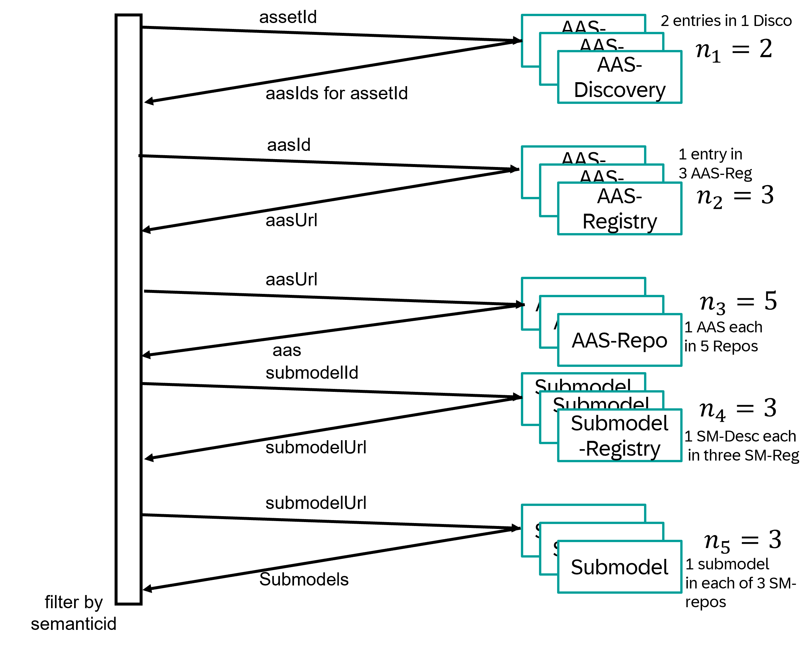
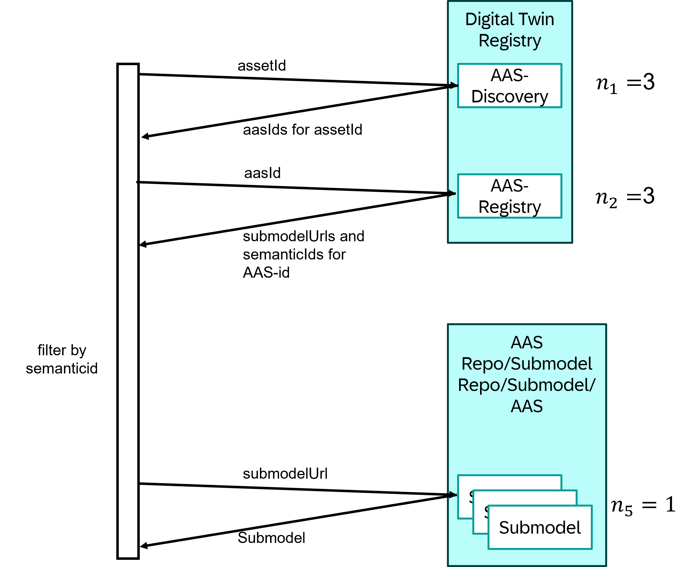

## ADR008 - Asset Administration Shell Profile for Factory-X

### Problem to be solved

The Asset Administration Shell API-specification (IDTA 01002-3-0) defines a discovery and retrieval process for
Submodels that makes life hard for Data Providers and Data Consumers. In the worst case, a Data Consumer must have prior
knowledge about:

1. the `globalAssetId` or at least one `specificAssetId` of the asset she’s looking for.
2. the `semanticId` of the interested submodel

and URLs of all

- n1 AAS-Discovery Services
- n2 AAS-Registry Services
- n3 Submodel-Registry Services

It also assumes that the Data Provider has
- Registered all Submodels in the relevant Submodel-Descriptors (in at least one Submodel-Registry)
- Registered all AAS in the relevant AAS-Descriptors (in at least one AAS-Registry)
- Registered all Submodels in the relevant AAS (in at least one AAS-Repository)
- Registered all AAS-to-assetId mappings (in at least one AAS-Discovery)

The complexity grows exponentially with each separately deployed service and linearly with each services mulitplicity.

### Solution description

By making more optional properties in the AAS specification mandatory, the complexity can be drastically reduced. The
ADR mandates the Data Provider to:

1. provide all `SubmodelDescriptor` objects as part of the `AssetAdministrationShellDescriptor` objects via the
AssetAdministratonShellRegistryServiceSpecification-SSP2.
2. provide `semanticId` as part of the `SubmodelDescriptor` object
3. provide all `Endpoint` objects as part of the `SubmodelDescriptor` objects linking to an API serving the 
`Submodel` interface.
4. serve the APIs of the AssetAdministrationShellRegistryServiceSpecification-SSP2 [1] and the
DiscoveryServiceSpecification-SSP1 [2] from a common URL-path.

This results in reduced complexity for Data Provider and Data Consumer alike. A client that makes a certain set of
different assumptions may not be compatible with Data Providers adhering to this ADR. Same holds true for clients
adhering to this ADR with servers deployed in a less governed setup.

### Expected business consequences

Data Providers will need to expose at least two public endpoints adhering to the mentioned API specifications. They will
likely need additional internal services ensuring consistency across the Registry- and Repository interfaces. This will
cause marginal integration cost.

Data Consumers will have to obtain knowledge about all Digital Twin Registry endpoints a Provider offers. What he
receives is a deterministic path to the data he is attempting to discover drastically reducing the cost of discovering
and fetching data.

The upcoming AAS-Spec releases in the 3.X line will be compatible to this ADR.

### Scope of the ADR

This ADR does not impede on any neighboring discovery mechanisms such as ID-Link.

### References

[1] [AssetAdministrationShellRegistryServiceSpecification | V3.0.3_SSP-001 | Plattform_i40 | SwaggerHub](https://app.swaggerhub.com/apis/Plattform_i40/AssetAdministrationShellRegistryServiceSpecification/V3.0.3_SSP-001)

[2] [DiscoveryServiceSpecification | V3.0.3_SSP-001 | Plattform_i40 | SwaggerHub](https://app.swaggerhub.com/apis/Plattform_i40/DiscoveryServiceSpecification/V3.0.3_SSP-001)
