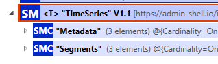
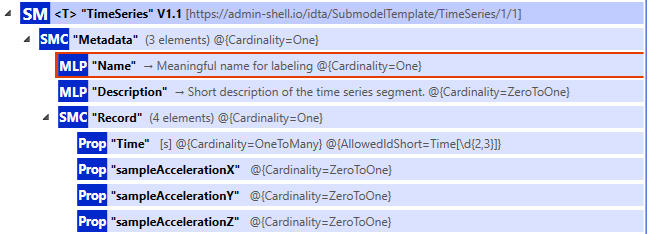
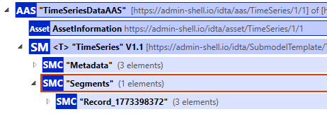
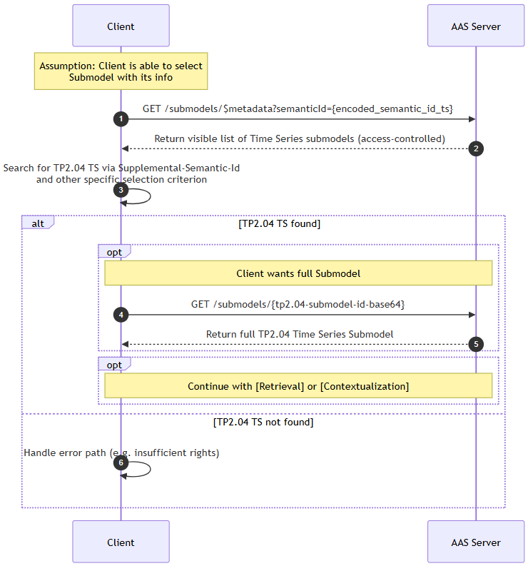
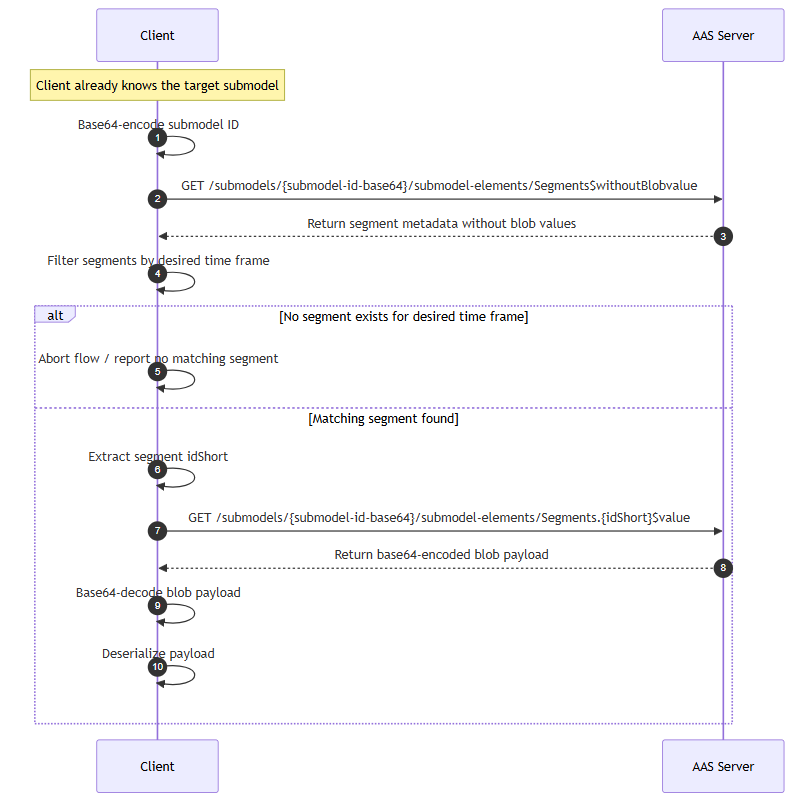

## Purpose

This Architecture Decision Record (ADR) provides normative guidance for the use case "Condition Monitoring led Services (CMLS)". These guidelines enable standardized, secure, and interoperable data exchange via the MX-Port and ensure data sovereignty for the CMLS use case. Our mission is to identify and remove data sharing barriers between parties to enable the widespread adoption of condition monitoring as a trigger for a new era of proactive, automated and remotely controlled services. This will lead to cost savings and productivity improvements for each participant. 

## Roles

- The **factory operator** runs the production system and typically acts as main data provider, sharing machine and process condition data to enable monitoring and optimization. 
- The **machine builder** uses the provided operational data as a data consumer to analyze machine behavior, improve machine performance, and offer services such as predictive maintenance. ​

- The **component supplier** assists the condition monitoring process with his expert knowledge and recommends maintenance actions.​

- The **software provider** supports the CMLS actors with appropriate analysis and collaboration software.

## API Structure

### Data Provider

The Data Provider MUST expose the endpoints according to the following Architecture Decision Records (ADRs):

| Architecture Decision Record (ADR)            | Version         | Link                      | 
| ------------------- | ------------ | ------------------------------------------------------ | 
| ADR 002 – Cross-Company Authorization and Discovery Version 0.2.0        | 0.2.0 | https://factory-x-contributions.github.io/architecture-decisions/docs/hercules_network_adr/adr002-authorization-discovery | 
| ADR 003 – Authentication for Dataspaces Version 0.2.0                    | 0.2.0 | https://factory-x-contributions.github.io/architecture-decisions/docs/hercules_network_adr/adr003-authentication | 


### Data Consumer

The Data Consumer MUST expose the endpoints according to the following Architecture Decision Records (ADRs):

| Architecture Decision Record (ADR)            | Version         | Link                      | 
| ------------------- | ------------ | ------------------------------------------------------ | 
| ADR 002 – Cross-Company Authorization and Discovery Version 0.2.0        | 0.2.0 | https://factory-x-contributions.github.io/architecture-decisions/docs/hercules_network_adr/adr002-authorization-discovery | 
| ADR 003 – Authentication for Dataspaces Version 0.2.0                    | 0.2.0 | https://factory-x-contributions.github.io/architecture-decisions/docs/hercules_network_adr/adr003-authentication | 

## Authentication and Authorization

Participants must comply to authentication and authorization defined ADR-002 and ADR-003.

## Data Models

The `Asset` can be the instance of a company, factory, machine, product or a software application.

### Submodels

The following submodels may be used for the Condition Monitoring Led Services use case. In the CMLS use-case, there are three scenarios which can benefit from a different set of submodels. Data providers may expose arbitrary additional submodels according to the need of their business processes.

- **Scenario 1**: Condition Monitoring: Continuous monitoring of machines and equipment using sensor data to assess their current condition
- **Scenario 2**: Detection of anomalies: Identification of unusual patterns or deviations in data streams that may indicate potential issues, faults, or security incidents.
- **Scenario 3**: Root Cause analysis: Systematic examination of data and events to determine the underlying cause of a problem and enable targeted corrective actions.

To describe the states of machines and components, we recommend using the VDMA Guideline 24582:2014-04 and its following asset state classifications:
- **Good**
- **Warning**
- **Critical Condition** 
- **No condition assertion**


| Standard                   | Version | Reference                                                                                                                    | Requirement type   |
| -------------------------- | ------- | --------------------------------------------------------------------------------------------------------------------------- | -------- |
| Digital Nameplate for industrial equipment        | 3.0  | [IDTA Submodel Template](https://github.com/admin-shell-io/submodel-templates/tree/main/published/Digital%20nameplate/3/0)   | mandatory |
| Generic Frame for Technical Data for Industrial Equipment in Manufacturing        | 2.0  | [IDTA Submodel Template](https://github.com/admin-shell-io/submodel-templates/tree/main/published/Technical_Data/2/0)  | mandatory |
| Contact Information        | 1.0  | [IDTA Submodel Template](https://github.com/admin-shell-io/submodel-templates/tree/main/published/Contact%20Information/1/0)  | mandatory |
| Hierarchical Structures enabling Bills of Material        | 1.1  | [IDTA Submodel Template](https://github.com/admin-shell-io/submodel-templates/tree/main/published/Hierarchical%20Structures%20enabling%20Bills%20of%20Material/1/1)  |  mandatory |
| Service Request Notification|  1.0| [IDTA Submodel Template](https://github.com/admin-shell-io/submodel-templates/tree/main/published/Service%20Request%20Notification/1/0)| optional
| Asset Interface Description        | 1.0  | [IDTA Submodel Template](https://github.com/admin-shell-io/submodel-templates/tree/main/published/Asset%20Interfaces%20Description/1/0)   | optional |
| Asset Interfaces Mapping Configuration        | 1.0  | [IDTA Submodel Template](https://github.com/admin-shell-io/submodel-templates/tree/main/published/Asset%20Interfaces%20Mapping%20Configuration/1/0)   | optional |
| Time Series Data (Extended)      | 1.1  |  [F-X Submodel Template](https://github.com/factory-x-contributions/TP2.4-AAS-Model/tree/main/TimeSeriesData_TP2.04Specification) and [Appendix](#appendix---time-series-data-submodel-idta-specification)  | optional |
| Handover documentation             | 2.0| [IDTA Submodel Template](https://github.com/admin-shell-io/submodel-templates/tree/main/published/Handover%20Documentation/2/0)| optional
| Maintenance instructions        | 1.0  | [IDTA Submodel Template](https://github.com/admin-shell-io/submodel-templates/tree/main/published/Production%20Calendar/1/0)   | optional |
| Carbon Footprint        | 1.0  | [IDTA Submodel Template](https://github.com/admin-shell-io/submodel-templates/tree/main/published/Carbon%20Footprint/1/0)  | optional |
| Data Model for Asset Location        | 1.0  | [IDTA Submodel Template](https://github.com/admin-shell-io/submodel-templates/tree/main/published/Data%20Model%20for%20Asset%20Location/1/0)  | optional |
| Predictive Maintenance | 1.0|     [IDTA Submodel Template](https://github.com/admin-shell-io/submodel-templates/tree/main/published/Predictive%20Maintenance/1/0)|optional
| Digital Quality Document (Digital Calibration Certificate) | 1.0|     [IDTA Submodel Template](https://github.com/admin-shell-io/submodel-templates/tree/main/published/Digital%20Quality%20Documents/Part%201%20Core%20Elements/1/0)| optional
| Production Calendar | 1.0|      [IDTA Submodel Template](https://github.com/admin-shell-io/submodel-templates/tree/main/published/Production%20Calendar/1/0)|optional
| Nameplate for Software in manufacturing  | 1.0|    [IDTA Submodel Template](https://github.com/admin-shell-io/submodel-templates/tree/main/published/Software%20Nameplate/1/0)| optional
| Plant Asset Management | 1.0|     [IDTA Submodel Template](https://github.com/admin-shell-io/submodel-templates/tree/main/published/Plant%20Asset%20Management%20Specification%20Sheet/1/0)| optional
| Purchase Order | 1.0|    [IDTA Submodel Template](https://github.com/admin-shell-io/submodel-templates/tree/main/published/Purchase%20Order/1/0)| optional
| Sensors 4.0 | 1.0| [IDTA Submodel Template](https://github.com/admin-shell-io/submodel-templates/tree/main/published/sensor4.0/Part%201%20Measurement%20Value/1/0)| optional|
| Maintenance recommendations | 1.0|     [F-X Submodel Template](https://github.com/factory-x-contributions/TP2.4-AAS-Model)| optional
| AMWMonitorJobConfig | 1.0|       [F-X Submodel Template](https://github.com/factory-x-contributions/TP2.4-AAS-Model)| optional
| AMWMonitorRun | 1.0|      [F-X Submodel Template](https://github.com/factory-x-contributions/TP2.4-AAS-Model)| optional
| Asset Status| 1.0|      [F-X Submodel Template](https://github.com/factory-x-contributions/TP2.4-AAS-Model)| optional


## Appendix - Time Series Data Submodel IDTA Specification

### Summary of the Problem Statement and Solution

The existing Time Series Submodel (V1.1 https://github.com/admin-shell-io/submodel-templates/tree/main/published/Time%20Series%20Data/1/1) allows various options for "storing" data, using metadata, and using optional fields. These options shall be narrowed down in order to share time series data between partners for condition monitoring purposes in Use Case TP2.04.

For this, fundamental assumptions must be made that participants (data producers/providers and consumers) are expected to fulfill. These assumptions ensure that the time series submodel can be populated cleanly without generating conflicts.

The solution consists of describing these fundamental assumptions here and defining the specification of the Time Series Submodel (V1.1) further.

### Objective

The description shall cover both the data of the demonstrators in TP2.04 and serve as a reference for future condition monitoring use cases. Anyone reading this description should be able to: provide data and interpret/use data.

### Assumptions

- **[Ann1]** Reliable time sources: e.g., synchronous NTP servers for coherent timestamps
- **[Ann2]** Time series per segment are written at once, are finalized, and are no longer modified. No runtime data. These are not part of this description.
- **[Ann3]** It is assumed that the data to be stored consists of finalized (high-frequency) measurement recordings.
- **[Ann4]** We use the TimeSeries Submodel in version 1.1 (it is not foreseeable within the project duration that V2 will be released).
- **[Ann5]** The cardinality is not adopted from the template. Our description is this Confluence page. (Background: In practice, there is no clear approach yet. If we create a formal template, it can always be added later.)

### Specification

Source code for the specification can be found under [factory-x-contributions-TP2.4-AAS-Model-TimeSeriesData_TP2.04Specification](https://github.com/factory-x-contributions/TP2.4-AAS-Model/tree/main/TimeSeriesData_TP2.04Specification)

The SM TimeSeries always consists of the submodel element itself and 2 SubmodelCollections:



The submodel element itself is extended with the Supplemental Semantic ID as follows:

```json
"supplementalSemanticIds": [
  {
    "type": "ExternalReference",
    "keys": [
      {
        "type": "GlobalReference",
        "value": "https://github.com/factory-x-contributions/TP2.4-AAS-Model/TimeSeriesData_TP2.04Specification"
      }
    ]
  }
]
```

The `supplementalSemanticIds` is only used at the top level, as it also applies to the subordinate elements and this definition is valid.

The submodel elements at the first hierarchy level are divided into two categories: Metadata, which describes the blob schema for all segments, and the individual time series segments (Segments), which are populated with additional metadata (e.g., start and end timestamps for easier searching) and the actual time series data.

#### Metadata

The metadata describes the individual columns of the data blobs contained in the segments, as well as general properties that apply to each segment.



**Required:**

- **Metadata** (Cardinality [1])
  - **Name** (Cardinality [1]): Description valid for all recordings
  - **Description** (Cardinality [0..1]): (Recommended: describe the source of the data)
  - **Record** (Cardinality [1]) — describes the "columns" in the blob (the idShort of the Property must be equal to the column name in the blob)
    - Timestamp
    - columnValue1
    - columnValue2
    - …
    - columnValueN

To enable automatic processing of the values in the "columns", each value must be assigned a semanticId of type IRDI.

##### Excursus: Semantic Description of Physical Units for Properties

In the following, step-by-step instructions are provided to describe a value of the type (degree-Celsius) temperature. They use IEC CDD concepts and ontologies to describe it as a physical quantity including its unit of measurement. ECLASS or [QUDT.org](http://QUDT.org) would be alternatives but won't be considered here.

###### 1. Find/Derive IRDI (International Registration Data Identifier, or other semantic identifier) for the submodel element.

To find an IRDI in the IEC CDD, proceed as follows:

- Look up the corresponding quantity and its "unit code" in IEC 62720, Tab. C.1. Here, "Celsius temperature" with unit code "UAD023".
- Derive the IEC CDD IRDI as: `0112/2///62720#UAD023`.

> **Note 1:** You'd expect to be able to find this on [cdd.iec.ch](https://cdd.iec.ch/), clicking 'Enter', and selecting 'Units of measurement (IEC 62720)' from the drop-down under 'Domain'. However, a dead-end. Presumably broken. Searching 'All kinds of items' for "UAD023", however, displays a site that appears entirely correct and consistent – although without a stable URL.

> **Note 2:** If you can't find an IRDI, any globally unique string will do instead. Reason: In the next steps, we're linking the submodel element to be described with its concept description. That link is via the submodel element's semantic ID, which is the ID of its concept description (or vice versa). Whether that is taken as a globally unique IRDI or other semantic identifier or, alternatively, as any other globally unique string, is technically irrelevant.

###### 2. Set the above IRDI as semantic ID for the submodel element.

See Note 2 above. The submodel element is linked to its concept description by means of its semantic ID. This semantic ID will be used as the ID for that concept description in step 4 below.

###### 3. If you haven't done so already, add a (initially empty) list of AAS concept descriptions to your environment.

```json
"conceptDescriptions": [

]
```

###### 4. Add a concept description for the submodel element.

This is an entry in `conceptDescriptions` in your AAS environment. A single entry has the below structure.

```json
{
  "idShort": "temperature",
  "id": "0112/2///62720#UAD023",
  "modelType": "ConceptDescription"
}
```

It's sensible, although not strictly necessary, to align `idShort` with the `idShort` of the submodel element to be described. It's critical to set `id` to the submodel element's semantic ID, here: `"0112/2///62720#UAD023"`. This (and only this) means that that submodel element is, semantically, a `"0112/2///62720#UAD023"`, i.e., a "Celsius temperature".

###### 5. Add an IEC 61360 data specification to the concept description.

This is an `embeddedDataSpecifications` entry within the above concept description and has the below structure.

```json
{
  "idShort": "temperature",
  "id": "0112/2///62720#UAD023",
  "embeddedDataSpecifications": [
    {
      "dataSpecification": {
        "type": "ExternalReference",
        "keys": [
          {
            "type": "GlobalReference",
            "value": "https://admin-shell.io/DataSpecificationTemplates/DataSpecificationIec61360/3/0"
          }
        ]
      },
      "dataSpecificationContent": {
        "preferredName": [
          {
            "language": "en",
            "text": ""
          }
        ],
        "unit": "°C",
        "unitId": {
          "type": "ExternalReference",
          "keys": [
            {
              "type": "GlobalReference",
              "value": "0112/2///62720#UAA033"
            }
          ]
        },
        "sourceOfDefinition": "https://cdd.iec.ch",
        "symbol": "T",
        "dataType": "REAL_MEASURE",
        "definition": [
          {
            "language": "en",
            "text": "temperature difference from the thermodynamic temperature of the ice point is called the Celsius temperature t, which is defined by the quantity equation: t = T - T0 where T is thermodynamic temperature and T0 =273,15 K."
          }
        ],
        "modelType": "DataSpecificationIec61360"
      }
    }
  ],
  "modelType": "ConceptDescription"
}
```

- For `unitId`, use an IRDI for the unit of measurement of the corresponding quantity. Note that Tab. C.1 in IEC 62720 lists ranges of options for every quantity name. Presumably, these aren't suggestions but constrain the selection. Here, for "Celsius temperature", only one option is given: "UAA033". Derive the IRDI as above: `"0112/2///62720#UAA033"`.

> **Note 1:** Searching for "UAD023" on [cdd.iec.ch](https://cdd.iec.ch/) produces a link to the CDD entry, here: [https://cdd.iec.ch/cdd/iec62720/iec62720.nsf/Units/0112-2---62720%23UAA033](https://cdd.iec.ch/cdd/iec62720/iec62720.nsf/Units/0112-2---62720%23UAA033), which is another way to find the IRDI.

> **Note 2:** Since this is a reference to an external resource – i.e., not a concept description in the same AAS environment –, the `type` is `ExternalReference` with a `GlobalReference`-type key, as shown above.

- `unit` is taken as the UAA033 "unit symbol" of Tab. C.2 in IEC 62720 or, equivalently, the 'Short name' in the CDD entry linked above.
- `sourceOfDefinition` was taken as the corresponding IEC CDD URL, i.e.: [https://cdd.iec.ch](https://cdd.iec.ch). This is consistent with taking the `text` of the `definition` from there as well.
- Choose a sensible `symbol`.
- Choose a sensible `dataType`. For physical quantities that have a unit of measurement attached, this will be the IEC 61360 `REAL_MEASURE` for all practical purposes.

###### 6. Done! 😊

#### Segments

In principle, the Time Series Submodel offers 3 options for data storage: External, Internal, and Linked Segments. Linked Segments are not relevant for the case discussed here and are therefore not described. In TP2.4, we focus on a specification of External Segments as a data-optimized alternative to Internal Segments.



##### Segments - Blob

In the individual segments, finalized, non-extendable time series are stored as blobs. Each segment is stored as an "External Segment".

**Description of the SMC "Record":**

1. We do not use `displayName`.
2. `idShort`: `Record_<UTC-Timestamp in Seconds of the start time>`
   (The timestamp is added to the idShort to ensure a unique name.)

There are exactly the following submodel elements of the SMC "Record" (meta-information for the individual segment as well as the data itself):

1. *(optional)* **"Name"**: Description of the recording, if different from Metadata Name
2. *(optional)* **"Description"**: (Recommended: describe the source of the data), if different from Metadata Description
3. **"StartTime"**: Timestamp\* when the time series in the segment begins.
4. **"EndTime"**: Timestamp\* when the time series in the segment ends.
5. **"Blob"**: Description in the next section.

\*In this section, the timestamp is specified as a string according to ISO 8601 with the following format: `%Y-%m-%dT%H:%M:%S.%3NZ` (e.g., `2025-02-16T10:58:44.965Z`). StartTime and EndTime may differ from the first and last time stored in the data blob.

###### Data Blob (Base64 encoded)

**Semantic ID:** [https://admin-shell.io/idta/TimeSeries/Blob/1/1](https://admin-shell.io/idta/TimeSeries/Blob/1/1)

No `supplementalSemanticIds` is used, as it is already specified at a higher level.

The blob itself is represented by a JSON with 2 properties:

- **columns**: "Headers" of the data. The name must be equal to the idShort of the Property in Metadata.
- **values**: The actual data.

The first column is always a 64-bit UTC timestamp in nanoseconds since 1970.

All values in the columns are enclosed in double quotes (`"`). The data types, units, etc., i.e., the semantic annotation of the column, are described in the Metadata submodel element.

```json
{
  "columns": ["string", "..."],
  "values": [["string", "..."], ["string", "..."]]
}
```

**JSON Schema Description for the Example Below**

- Description of the JSON format: [demonstrators-tp2.4/Common/TP2.04_TimeSeriesSubmodel/BlobDefinition at main · factory-x-contributions/demonstrators-tp2.4](https://github.com/factory-x-contributions/demonstrators-tp2.4/tree/main/Common/TP2.04_TimeSeriesSubmodel/BlobDefinition)
- Formatting of data points: Each data point is represented as a string. Except for "Time", the values must consist of numbers and at most one dot. (Exponential notation is not allowed.)
- Prerequisite: There are no missing data points. The measurement system performs a gapless recording. (i.e., no NaN)

**Example**

```json
{
  "columns": ["Time", "EngineTemperature", "RotationSpeed", "VibrationRMS", "OilPressure", "FuelConsumptionRate"],
  "values": [
    ["1732521600000000000", "85.2", "1850", "0.45", "0.38", "0.52"],
    ["1732521600000001000", "85.2", "1850", "0.45", "0.38", "0.52"],
    ["1732521600000002000", "85.2", "1850", "0.45", "0.38", "0.52"],
    ["1732521600000003000", "85.2", "1850", "0.45", "0.38", "0.52"]
  ]
}
```

### Data Access Description

The access to TP2.04 time series data can be roughly divided into 3 workflows:

- **[Discovery]** How does a client find the TP2.04 Time Series Submodel among the submodels of an AAS?
- **[Retrieval]** Retrieval of the actual time series data from the segments, or the metadata.
- **([Contextualization])** Merging the data from the segment with the metadata.

Here, the data access and discovery process are described, with a focus on the segments. For each workflow, there is a sequence diagram with a subsequent brief explanation of the details. Since the contextualization happens based on the discovered and retrieved Meta and Record data it isn't explicitly illustrated in a sequence diagram.

#### Discovery

It is assumed that the client typically knows the ID of the AAS to which the submodel is attached (for example by obtaining the id via an event notification) - otherwise the AAS-ID must be obtained using a different flow. 
From there the Submodels can be checked for the supplemental semantic id (see below).

If the client has some other criterion on the submodel level, the Submodel Repository API can be used to search across all submodels to find the corresponding submodel as illustrated in _Fig. Discovery Flow Semantic-ID_. Note that it has to match the supplemental semantic id.



**Fig. Discovery Flow Semantic-ID**

**Remarks:**

- Current implementations do not provide an endpoint for querying submodels based on the Supplemental Semantic ID. Therefore, all submodels or Time Series Submodels must first be retrieved via the base64-encoded Semantic ID, and then checked for the Supplemental Semantic ID in a second step.
- In this workflow, the metadata `$metadata` of all 'readable' (access-controlled) submodels of the AAS server is retrieved, which can result in a large volume.
- It was assumed that the client can filter the correct submodel based on a criterion.

#### Retrieval

It is assumed that the submodel where one searches for the segments is known (i.e., the submodel ID is known).

**Query the segments:**

```
<baseurl>/submodels/{submodel-id (base64 encoded)}/submodel-elements/Segments$withoutBlobvalue
```

**Query a specific blob:**

```
<baseurl>/submodels/{submodel-id (base64 encoded)}/submodel-elements/Segments.{idShort of the segment}$value
```


**Fig. Segment Retrieval**

